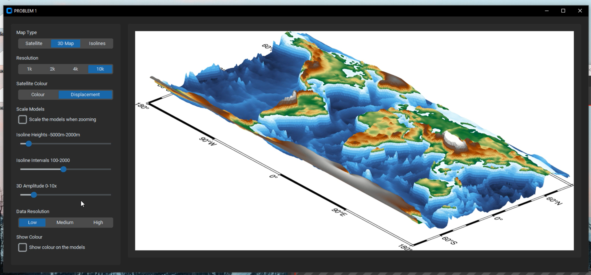
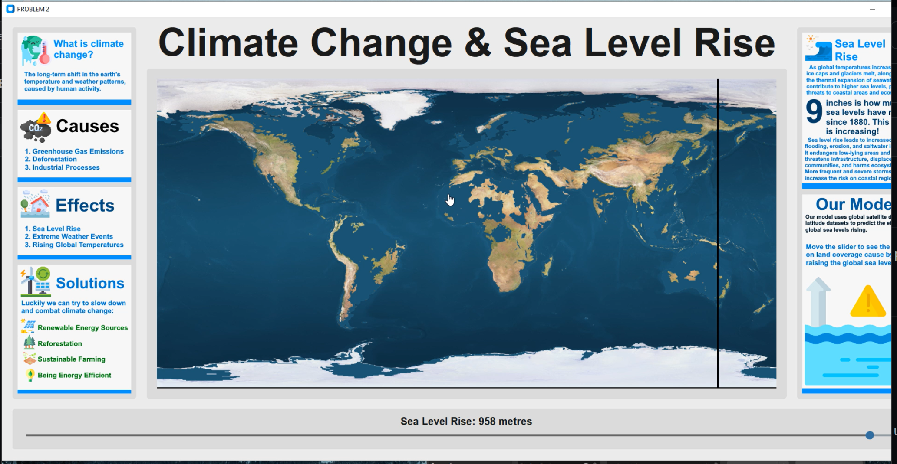

# Using PYGMT to create viewer software
Note that to run, you must run in a Conda environment with PyGMT, pillow, numpy and customtkinter installed. Does not work with pip! 
## Viewer
This software allows the user to view the earth in different modes, it is aimed at developers and researchers.

(viewer.py)

## Climate Viewer
This program is an educational tool, aimed to teach students about the effects of climate change and sea level rise. Infographics are used to make the tool more visually appealing and educational.

(climate_viewer.py)

